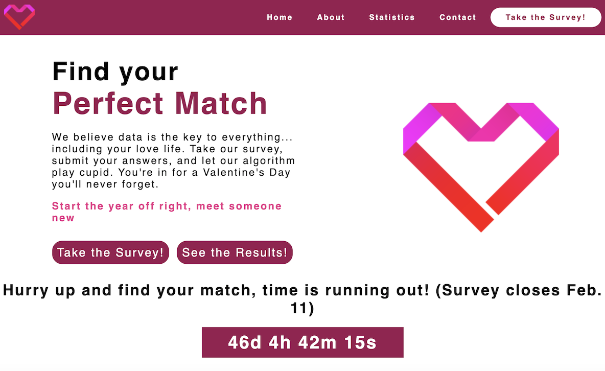

# perfect-match

Project created for INFO 1300, Introductory Design and Programming for the Web. Created a website for our client, Cornell Business Analytics. This website will host CBA's Perfect Match Survey, which was created to get into the Valentine's Day Spirit by matching up Cornell students!

